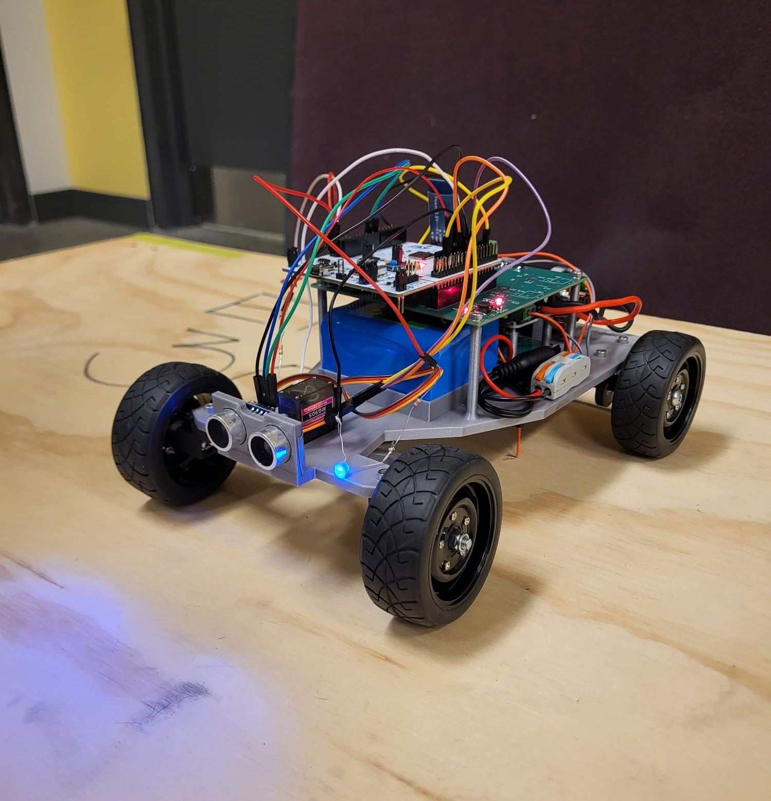
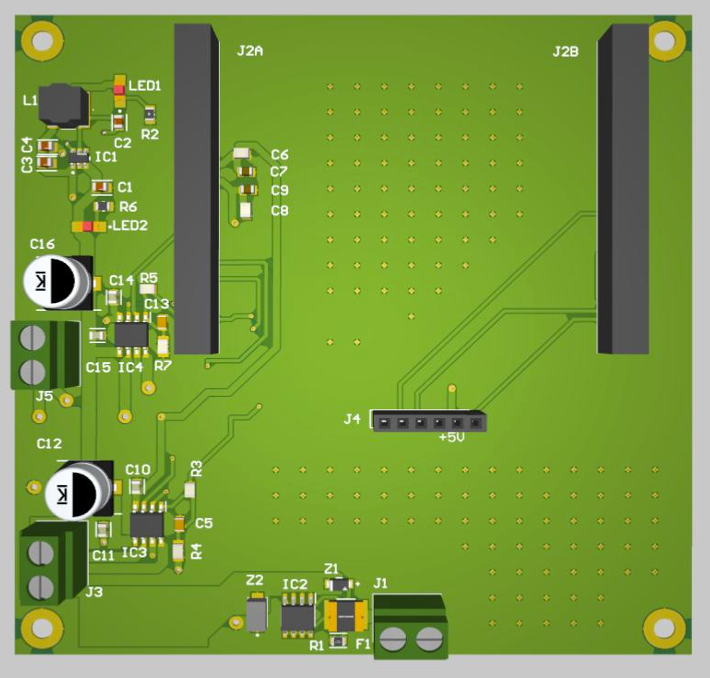
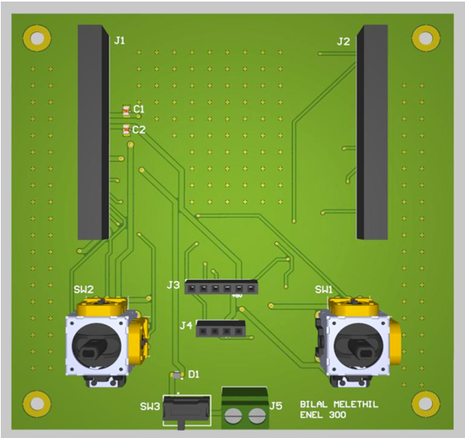
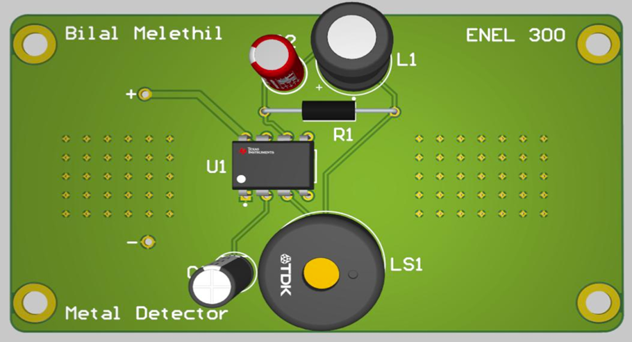
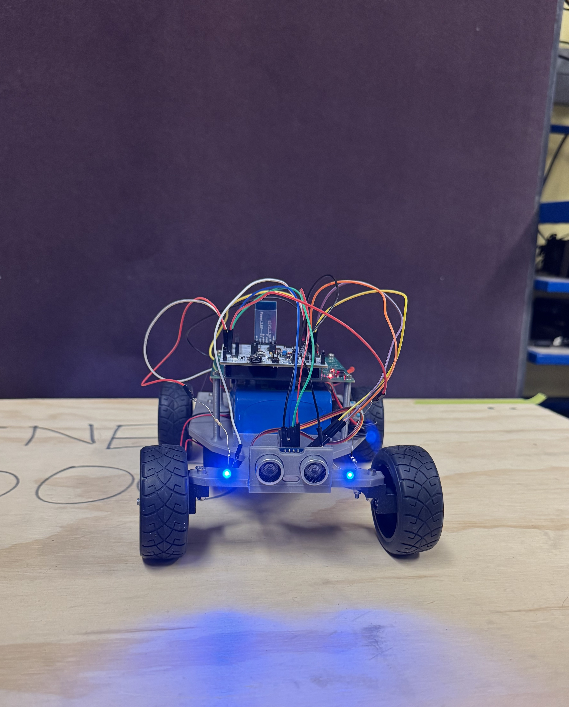
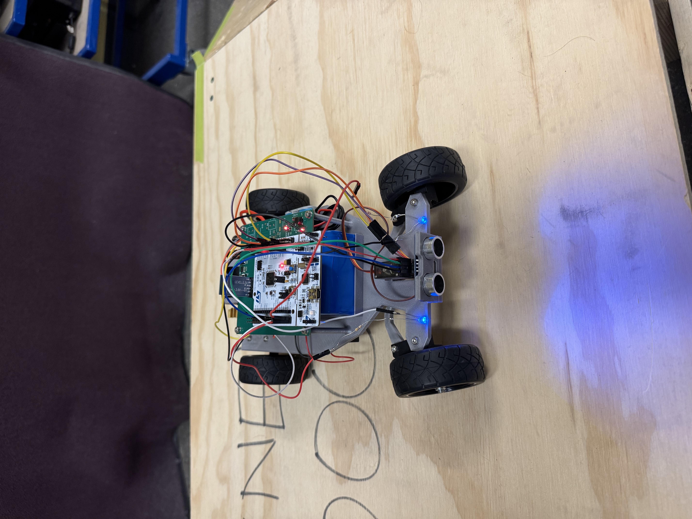
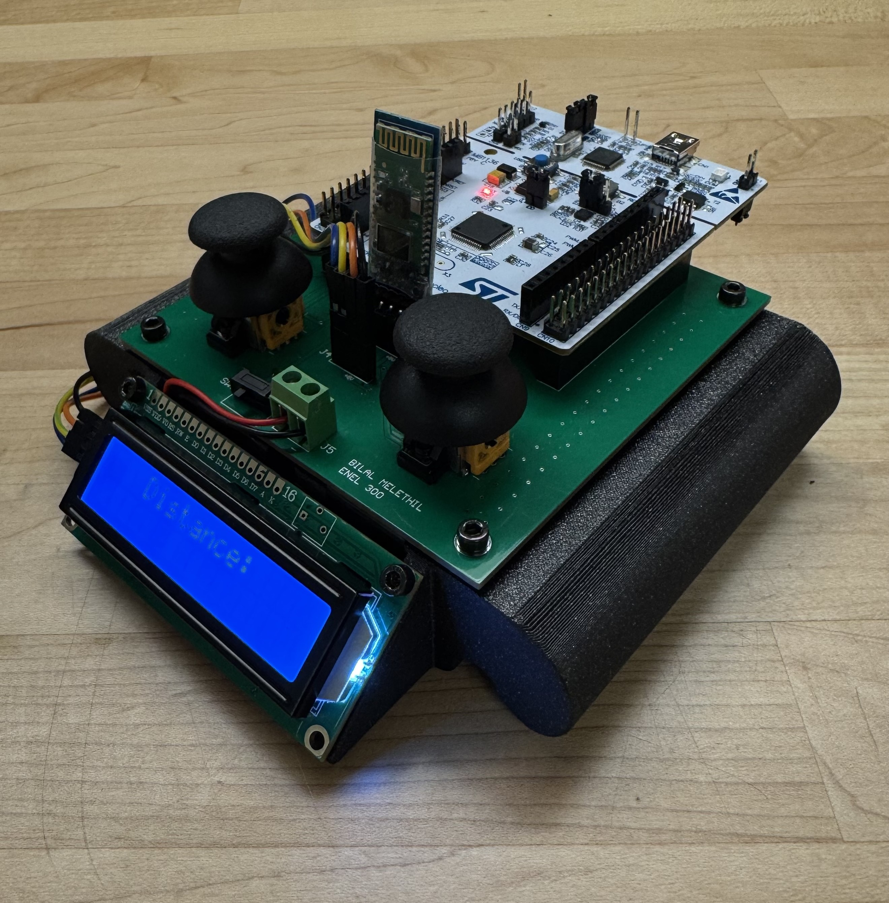
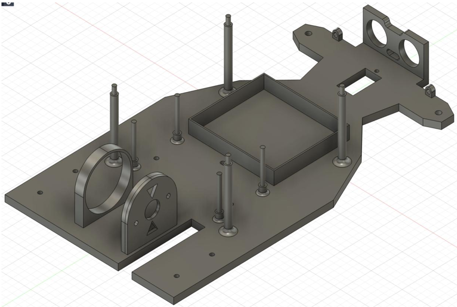

# STM32 Radio-Controlled Car with Metal Detection & Distance Sensing   

This project was completed as part of ENEL 300 at the University of Calgary. The course required teams to design and demonstrate a self-powered RC vehicle with wireless control, sensing, custom PCB integration, 3D-printed mechanical design, and budget-constrained engineering tradeoffs. 
Placed **2nd out of 40 teams** in the Winter 2026 final competition. 🥈

---

## Project Summary

This project integrates electrical design, embedded firmware, wireless communication, sensing, power management, and mechanical design into a self-powered RC vehicle.

The system uses a **vehicle STM32** and a **controller STM32**. The controller reads joystick inputs and sends commands wirelessly through HC-05 Bluetooth. The vehicle receives those commands, controls the DC motor and steering servo, measures distance using an HC-SR04 ultrasonic sensor, detects metal using a separate detector circuit, and sends distance feedback back to the controller LCD.

---

## Final Build

<p align="center">
  
</p>

<p align="center">
  <b>Final integrated vehicle with STM32 control, custom PCB hardware, ultrasonic sensing, Bluetooth communication, headlights, metal detection, and onboard power.</b>
</p>

---


---

## Key Features

- Wireless control using paired **HC-05 Bluetooth modules**
- Dual **STM32 NUCLEO-F446RE** architecture
- PWM-based DC motor speed and direction control
- PWM servo steering
- HC-SR04 ultrasonic distance sensing
- Real-time distance feedback to controller LCD
- Metal detection circuit with buzzer feedback
- Headlight control from controller button
- Custom vehicle, controller, and metal detector PCBs
- 3D-printed chassis, controller housing, drivetrain, and steering components
- Battery-powered system completed under a **$120 CAD** budget

---

## System Architecture

```text
Controller STM32
  ├── Reads joystick inputs
  ├── Sends throttle/steering/headlight commands over Bluetooth
  ├── Receives distance telemetry
  └── Displays distance on LCD

Bluetooth UART Link

Vehicle STM32
  ├── Receives wireless control commands
  ├── Drives DC motor through motor driver
  ├── Controls steering servo using PWM
  ├── Measures distance using HC-SR04
  ├── Controls headlights
  └── Sends distance telemetry back to controller
```

For detailed firmware diagrams and code-level architecture, see the individual firmware READMEs:

- [`Car Firmware README`](./enel-300-parallax/README.md)
- [`Controller Firmware README`](./enel-300-truncate/README.md)

---
## Demo

### Competition Drive Demo

[Watch Drive Demo](enel-300-parallax/docs/media/car-drive-circuit1.mp4)

The vehicle demonstrates wireless throttle and steering response during the competition circuit using STM32-based Bluetooth control.

### Distance Sensing and Controller Feedback

[Watch Distance Telemetry Demo](enel-300-truncate/docs/media/distance-sensing.mp4)

The vehicle measures distance using the HC-SR04 ultrasonic sensor and sends telemetry back to the controller LCD over the Bluetooth UART link.

---

## Hardware Overview

| Subsystem | Implementation |
|---|---|
| Microcontroller | STM32 NUCLEO-F446RE |
| Wireless Communication | HC-05 Bluetooth over UART |
| Motor Drive | DRV8251ADDAR motor driver |
| Steering | Servo motor controlled using PWM |
| Distance Sensing | HC-SR04 ultrasonic sensor |
| Metal Detection | LM555-based detector circuit with buzzer |
| Display | I2C LCD on controller |
| Main Vehicle Power | 12 V, 5600 mAh lithium-ion battery |
| Controller Power | Separate 9 V battery |
| PCB Design | Altium Designer |
| Mechanical Design | Fusion 360, 3D-printed PLA components |

---

## Custom PCB Integration

Three custom PCBs were designed to organize and integrate the electrical system:

1. **Vehicle PCB**  
   Integrated the motor driver, voltage regulation, STM32 headers, Bluetooth connections, and vehicle-side wiring.

<p align="center">
  
</p>

2. **Controller PCB**  
   Supported the joystick inputs, STM32 controller board, Bluetooth module, LCD display, and button interface.

<p align="center">
  
</p>

3. **Metal Detector PCB**  
   Implemented the LM555-based metal detection circuit with buzzer feedback.

<p align="center">
  
</p>

---

## Final Vehicle and Controller

### Vehicle Front View

<p align="center">
  
</p>

### Vehicle Top View

<p align="center">
  
</p>

### Controller

<p align="center">
  
</p>

---

## Mechanical Design

The vehicle chassis, controller housing, rear axle supports, gears, tie rod, and steering links were designed in Fusion 360 and 3D printed in PLA.

The final drivetrain used a **2.375:1 gear ratio** after packaging constraints prevented the originally planned 4:1 ratio. Higher PWM input was used to compensate for the lower gear reduction.

<p align="center">
  
</p>

---

## Testing and Validation

The system was tested through staged subsystem validation before final integration:

- Joystick input testing
- HC-05 Bluetooth pairing and UART communication
- Motor driver and PWM validation
- Servo steering validation
- HC-SR04 distance sensing
- LCD telemetry display
- Metal detector buzzer activation
- Battery-powered full-system testing
- Final competition trials

---

## Results

- Placed **2nd out of 40 teams** in the ENEL 300 Winter 2026 final competition
- Completed final design under the **$120 CAD** budget with a final BOM of approximately **$118.01 CAD**
- Achieved wireless control between two STM32 boards using Bluetooth UART
- Integrated motor control, steering, distance sensing, LCD feedback, headlights, metal detection, custom PCB hardware, and 3D-printed mechanical components into one working system
- Demonstrated reliable vehicle operation during final testing and competition runs

---

## Skills Demonstrated

- Embedded C programming
- STM32 HAL development
- UART communication
- PWM motor and servo control
- Analog joystick input processing
- Ultrasonic distance sensing
- I2C LCD interfacing
- PCB design in Altium Designer
- Motor driver integration
- Power distribution and voltage regulation
- Battery-powered embedded systems
- Hardware/software debugging
- 3D-printed mechanical integration
- System-level testing

---

## Team

| Team Member | Main Contributions |
|---|---|
| Saad Subhani | STM32 firmware, Controls and electrical integration, embedded debugging |
| Bilal Melethil | PCB design, Altium layout, Controls and electrical integration |
| Ammaar Khaleel | 3D modelling, chassis design, controller housing, mechanical integration |
| Arsalan Khan | Gear design, drivetrain support, mechanical subsystem development |
| Omar Taktak | System integration, testing, project support |

---

## Repository Structure

```text
.
├── enel-300-parallax/
│   ├── Core/              # Vehicle-side STM32 source code
│   └── docs/media/        # Vehicle photos, PCB renders, chassis media, drive demo
├── enel-300-truncate/
│   ├── Core/              # Controller-side STM32 source code
│   └── docs/media/        # Controller photos, PCB render, distance telemetry demo
├── .gitignore
└── README.md

```

---

## Project Context

This project was completed as part of ENEL 300 at the University of Calgary. The course required teams to design and demonstrate a self-powered RC vehicle with wireless control, sensing, custom PCB integration, 3D-printed mechanical design, and budget-constrained engineering tradeoffs, and system-level integration into a working competition prototype.
