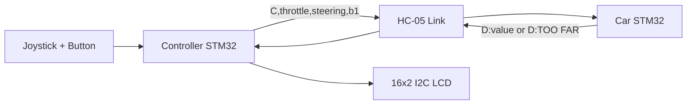

# ENEL-300 Truncate Controller Firmware

STM32 firmware for the **handheld controller node** in the ENEL-300 wireless parallax demo. This project samples joystick ADC channels, sends control packets over Bluetooth, receives distance telemetry, and renders feedback on a 16x2 I2C LCD.

## Highlights

- Dual-channel ADC sampling with simple averaging
- Periodic control packet transmit (`C,<throttle>,<steering>,<button>`)
- Incoming distance frame parsing with input validation
- LCD output formatting and centered feedback display
- Lightweight non-blocking UART polling loop

## System Role in the Full Demo

## Packet Protocol

### TX (Controller -> Car)

- `C,<throttle_adc>,<steering_adc>,<b1_state>\n`

### RX (Car -> Controller)

- `D:<distance_cm>\n`
- `D:TOO FAR\n`

Only numeric payloads (with optional single decimal point) are accepted for distance rendering.

## Pin Map (From Current `.ioc` Configuration)

| Function | Peripheral/Pin | Notes |
|---|---|---|
| Joystick X | `ADC1 CH0` (`PA0`) | Steering input |
| Joystick Y | `ADC1 CH8` (`PB0`) | Throttle input |
| User button | `B1` | Included in control packet |
| Bluetooth data | `USART1` | HC-05 link |
| Debug console | `USART2` | `printf` output |
| LCD | `I2C1` | 16x2 character display |

> Final pin routing is generated from `enel-300-truncate.ioc`.

## Build and Flash

1. Open `enel-300-truncate.ioc` in STM32CubeIDE
2. Build the project
3. Flash to your board

## Docs

- Docs checklist and media guidance: `docs/README.md`
- Demo photos under `docs/media/`

## Project Layout

- `Core/Src/main.c`: Main control and Bluetooth/LCD logic
- `Core/Inc/`: App and HAL headers
- `Drivers/`: HAL + CMSIS
- `Debug/`: Generated build artifacts
