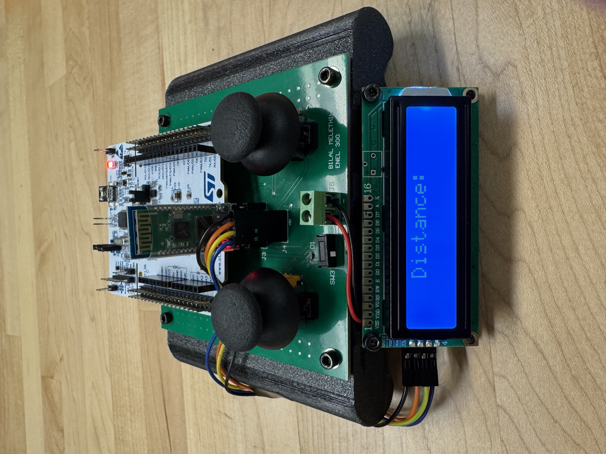
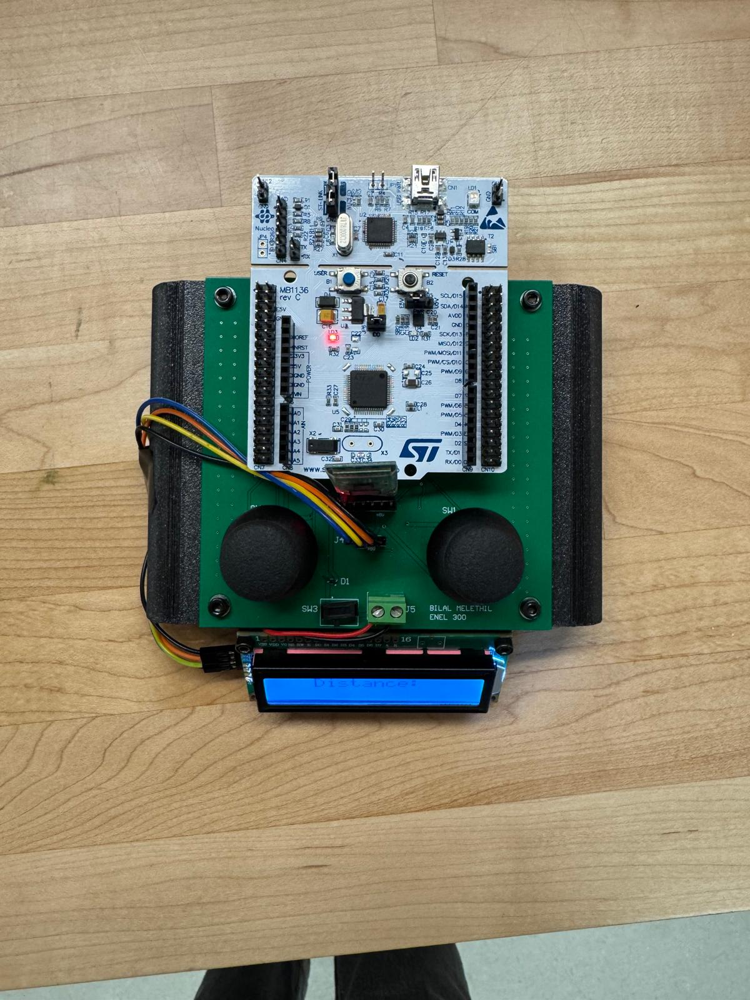
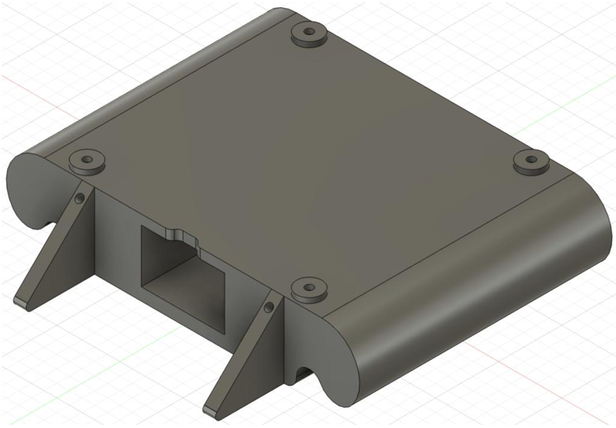

# Controller Firmware and Hardware Documentation

This folder contains supporting documentation and media for the controller-side STM32 firmware and hardware integration.

The controller subsystem reads joystick inputs, sends wireless commands to the vehicle over Bluetooth, receives distance telemetry from the vehicle, and displays feedback on the LCD.

---

## Controller Overview

The controller is built around an **STM32 NUCLEO-F446RE** and uses two analog joysticks for user input. Control commands are transmitted to the vehicle using an **HC-05 Bluetooth module** over UART.

The controller also receives ultrasonic distance measurements from the vehicle and displays them on an I2C LCD.

---

## Demo

### Distance Sensing and LCD Telemetry

[Watch Distance Sensing Demo](media/distance-sensing.mp4)

This demo shows distance telemetry being received from the vehicle and displayed on the controller. The vehicle measures distance using the HC-SR04 ultrasonic sensor, sends the value back through the Bluetooth UART link, and the controller updates the LCD display.

---

## Controller Hardware

### Controller Front View



Front view of the handheld controller showing the joystick interface, display placement, and user-facing control layout.

### Controller Side View


Side view of the controller assembly showing the physical layout and component integration.

### Controller Top View



Top view of the controller showing the STM32 board, joystick layout, LCD interface, Bluetooth module integration, and wiring organization.

---

## Controller PCB


The controller PCB organizes the joystick inputs, STM32 headers, Bluetooth interface, LCD wiring, and button input used for headlight control. It was designed to reduce wiring complexity and provide a cleaner interface between the user controls and the STM32 controller firmware.

---

## Controller Mechanical Design



The controller housing was designed to support the controller PCB, joystick modules, STM32 board, LCD display, Bluetooth module, and user interface components in a compact handheld form.

---

## Controller Subsystem Responsibilities

The controller-side STM32 firmware is responsible for:

- Reading analog joystick inputs
- Mapping joystick values to throttle and steering commands
- Sending movement commands to the vehicle over Bluetooth UART
- Sending headlight control commands
- Receiving distance telemetry from the vehicle
- Displaying distance feedback on the LCD
- Maintaining user-facing control and feedback behavior

---

## Communication Flow

```text
Joystick Inputs
      ↓
Controller STM32
      ↓
UART Transmission
      ↓
HC-05 Bluetooth Module
      ↓
Wireless Link
      ↓
Vehicle HC-05 Bluetooth Module
      ↓
Vehicle STM32
      ↓
Motor, Steering, Headlights, and Sensor Response
```

Return telemetry:

```text
Vehicle HC-SR04 Distance Measurement
      ↓
Vehicle STM32
      ↓
Bluetooth UART Link
      ↓
Controller STM32
      ↓
I2C LCD Display
```

---

## Hardware Interfaces

| Interface | Purpose |
|---|---|
| ADC | Reads analog joystick values |
| UART | Communicates with HC-05 Bluetooth module |
| I2C | Sends data to LCD display |
| GPIO | Reads button input for headlight control |
| 5 V / 3.3 V rails | Supports LCD, Bluetooth, joystick, and STM32 logic requirements |

---

## Testing and Validation

The controller subsystem was tested through staged validation:

1. Joystick input testing
2. ADC value verification
3. Bluetooth pairing with vehicle-side HC-05 module
4. UART command transmission testing
5. LCD display testing
6. Distance telemetry reception
7. Headlight command testing
8. Full controller-to-vehicle integration

---

## Media in This Folder

```text
docs/media/
├── controller-front.jpeg
├── controller-side.jpeg
├── controller-top.jpeg
├── controller-pcb.png
├── controller-chassis.png
└── distance-sensing.mp4
```

---

## Notes for Future Updates

Recommended future additions:

```text
docs/media/
├── controller-demo.gif
├── joystick-response.mp4
├── lcd-closeup.jpeg
├── controller-wiring-labeled.jpeg
└── controller-block-diagram.png
```

Before linking this repository on a resume or LinkedIn, it would be useful to add a short controller demo showing:

- Joystick movement
- UART command transmission behavior
- LCD telemetry updates
- Headlight button response
